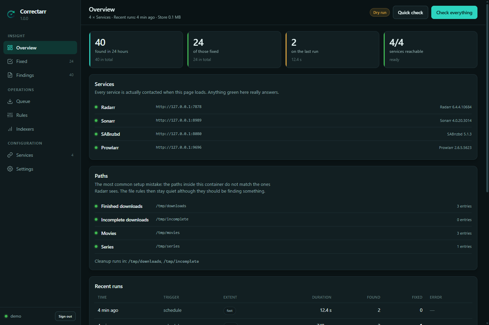
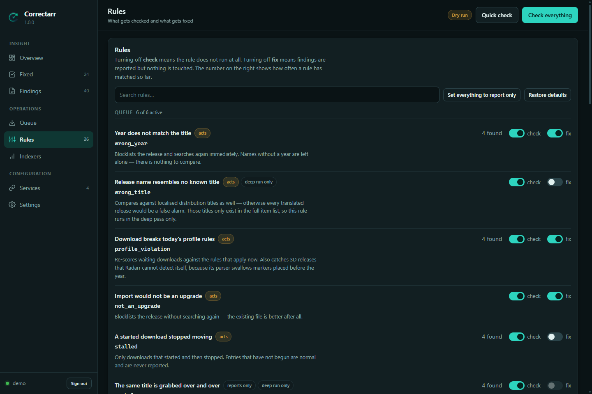
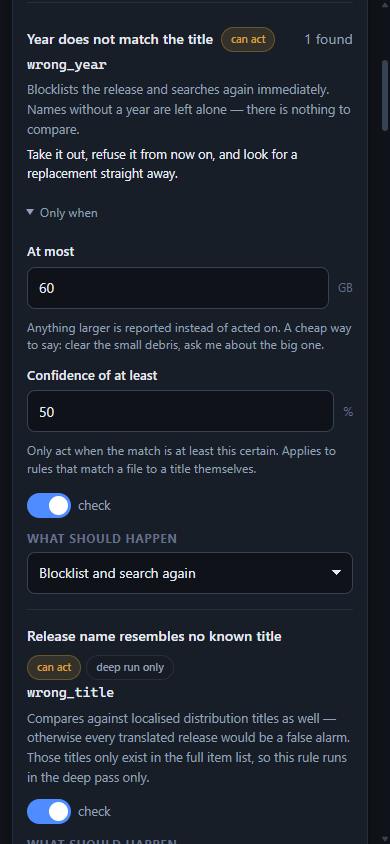
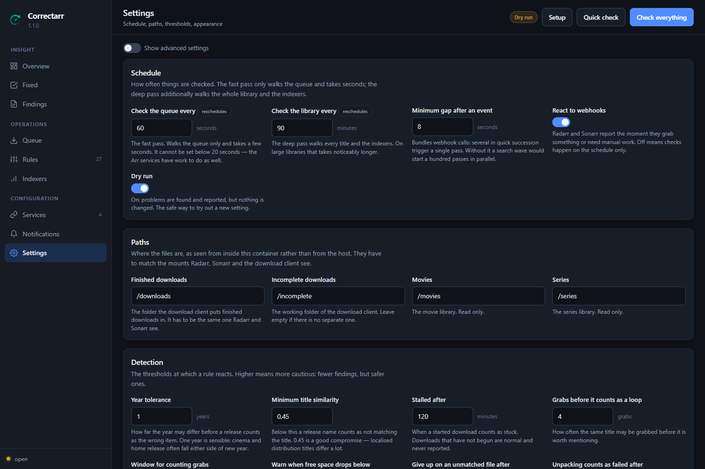
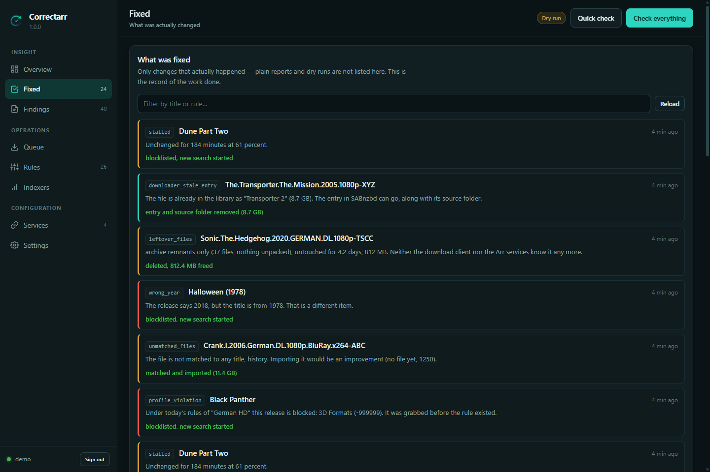

<div align="center">

# Correctarr

**Finds and fixes the problems Radarr, Sonarr, SABnzbd and Prowlarr leave
lying around — the ones that sit there because nobody is looking.**

[](https://github.com/flizzy27/Correctarr/actions/workflows/docker.yml)
[](LICENSE)



</div>

---

## What it is for

Radarr does notice some of these, but it never resolves them on its own:

| Problem | What happens |
|---|---|
| **Wrongly matched releases** | Radarr stops with "Manual Import required" and then waits forever. From production: `Halloween.2018…` had been matched to *Halloween (1978)*. |
| **Downloads after a profile change** | A release is scored exactly once, when it is grabbed. Change a profile afterwards and downloads already in flight run to nothing. |
| **Files that cannot be matched** | Radarr does not find `Crank.I.2006`, although the film is in the library as *Crank* with the alternate title *Crank 1*. Files like that sit there finished for days. |
| **3D releases** | Radarr structurally cannot reject them — its parser swallows markers placed before the year. |
| **Leftover debris** | Half RAR sets, empty folders, failed downloads. |
| **Quiet indexer problems** | A disabled indexer is easy to miss but affects every single search. |

## How it works

Three ways, at the same time:

1. **Events** — Radarr and Sonarr report through a webhook the moment they grab
   something or need manual work. Reaction within seconds, before a wrong
   download has even finished.
2. **Fast pass** — 60 seconds by default, queue rules only.
3. **Deep pass** — 90 minutes by default, additionally the library and the
   indexers.

## The rules

**32 rules across six categories.** For each one you decide what happens when
it finds something — not just on or off:

| | |
|---|---|
| **report only** | write it down, change nothing |
| **remove from the queue** | it may be grabbed again |
| **blocklist** | and never this release again |
| **blocklist and search again** | and look for a replacement now |
| **import** / **import and clean up** | bring the file in, optionally clearing the download client entry |
| **search** / **read the file again** | ask the service to look again |
| **delete** | remove the files from disk |
| **take off the blocklist** | let a release that was refused long ago be tried again |

On top of that, a rule can carry **conditions**: *wait at least six hours*,
*nothing over 20 GB*, *only when the match is at least 90 % certain*. A finding
that fails one is still reported — it is just not acted on, and it says why.

And a single **dry run** switch stops every change at once, across every rule
— **on by default**. A fresh install runs every rule, reports everything it
finds and touches nothing, until you have seen the findings and turned it off
yourself.

<details>
<summary><strong>All 32 rules</strong></summary>

### Queue
| Rule | What it finds | Default action |
|---|---|---|
| `wrong_year` | Year in the release name does not match the title | *Blocklist and search again* |
| `wrong_title` | Release name resembles no known title | Report only |
| `profile_violation` | Download breaks today's profile rules | *Blocklist and search again* |
| `not_an_upgrade` | Import would not be an upgrade | *Blocklist* |
| `stalled` | A started download stopped moving | Report only |
| `premature_grab` | A release for something that is not out yet | Report only |
| `grab_loop` | The same title is grabbed over and over | Report only |

### Import
| Rule | What it finds | Default action |
|---|---|---|
| `manual_import` | Import waiting on manual work, but the match is right | *Import* |
| `unpack_failed` | Unpacking really failed | Report only |
| `detached_folder` | Service and container see different download folders | Report only |
| `leftover_files` | Leftover download debris | **Delete from disk** |
| `unmatched_files` | File without a match — matches it itself | *Import and clean up* |

### Library *(deep pass only)*
| Rule | What it finds | Default action |
|---|---|---|
| `missing_audio_language` | Existing file lacks the wanted audio language | Report only |
| `unreadable_file` | File cannot be read | Report only |
| `below_profile` | Existing file would be blocked today | Report only |
| `missing_items` | Monitored and released, but no file | Report only |
| `cutoff_unmet` | Present, but below the quality that was asked for | Report only |
| `season_gaps` | A season that is only partly there *(Sonarr)* | Report only |
| `series_incomplete` | A finished series that is still incomplete *(Sonarr)* | Report only |
| `stale_blocklist` | An old refusal that may be why a title never arrives | Report only |

### Download client
| Rule | What it finds | Default action |
|---|---|---|
| `downloader_warning` | SABnzbd is reporting a warning | *Acknowledge the warning* |
| `downloader_stale_entry` | Entry finished, file long since imported | **Remove the entry and its folder** |
| `downloader_paused` | The download client is paused | Report only |
| `downloader_disk_space` | Little free space | Report only |
| `downloader_update` | A new version is available | Report only |

### Indexers *(read only)*
| Rule | What it finds | Default action |
|---|---|---|
| `indexer_disabled` | Prowlarr has switched an indexer off | Report only |
| `indexer_ineffective` | Many queries, practically no grabs | Report only |
| `indexer_ranking` | The order contradicts the measured usefulness | Report only |
| `indexer_unknown` | Indexer bypasses Prowlarr | Report only |

### System
| Rule | What it finds | Default action |
|---|---|---|
| `service_health` | The service reports a problem about itself | Report only |
| `disk_space` | Free space is running low | Report only |
| `api_changes` | The service marked a call this makes as on its way out | Report only |

</details>

**Guiding principle: when in doubt, do nothing.** A rule that is not sure only
reports. Better one finding left alone than one good file thrown away. And a
fresh install starts with the **dry run on**: everything is found and reported,
nothing is touched, until you have seen the findings and turned it off.



Every rule shows what it does before you turn it on: whether it only reports,
acts, or deletes; whether it runs on every pass or only the deep one; and how
often it has matched so far. A rule only offers the conditions its own findings
can actually answer, so you cannot set one that could never be met.

### On a phone, too



The interface is the same one at every size — nothing is hidden on a small
screen and there is no separate mobile version to fall behind. Below 620 pixels
the columns stack, the navigation becomes a row of tabs across the top, and
every control you tap grows to a size you can hit without aiming. It has been
checked from 320 pixels up to 4K, on every page, with nothing running off the
side at any width.

<br clear="right">

## Three things Radarr cannot do itself

**Radarr does not see the whole release name.** A custom format with a title
regex is applied to what is left after the recognised title has been split off.
Markers placed before the year are swallowed by the parser:

```
Black.Panther.3D.HOU.2018…  → parsed title "Black Panther 3D HOU", 3D not detected
Meg.2018.HSBS…              → parsed title "Meg",                  3D detected
```

Radarr structurally cannot reject those. Correctarr checks the raw name.

**Radarr scores only once.** Waiting downloads are never re-examined against
changed profile rules. Correctarr re-scores them.

**Radarr compares years exactly.** Its own year check accepts the filed year
and the premiere year, and nothing else. That is narrow in one direction and
blind in the other — see below.

### The year check, in detail

Comparing the year in a release name with the year the service holds looks like
a subtraction. It is not, and getting it wrong is expensive both ways.

*It accuses good releases.* `1917.German.DL.1080p.BluRay.x264-GROUP` states no
release year at all — but read the first four digits and you "find" 1917 and
compare it with 2019. Same for `2012`, `Blade Runner 2049`,
`2001: A Space Odyssey`, and a resolution written out as `1920x1080`.

*It also rejects differences that are perfectly normal.* A film that premiered
at a festival one year and reached cinemas the next is filed under different
years by different databases, and release groups follow the earlier one. A film
that opened in a handful of cinemas on 25 December and went wide in January is
filed under December. A Japanese film released at home a year before it reached
the West carries its home year. Reject those and the same release is grabbed,
rejected and grabbed again, forever.

Correctarr discounts numbers that belong to the title, ignores spelled-out
resolutions, and accepts the premiere year and every release date the service
already holds instead of guessing a window. Each finding carries a confidence,
so you can have it act on a twenty-year gap and merely report a two-year one.

Everything else that turned up in production is written down in
[`docs/background.md`](docs/background.md).

## Setup

### Unraid

Search for *Correctarr* in **Community Applications**. The required settings are
the port, the configuration directory and the folder holding finished downloads.

> **About the paths:** they have to be the same inside the container as the ones
> Radarr and Sonarr see. Mount the download folders exactly the way you mounted
> them there. The overview page shows you whether that worked.

### Docker

```bash
docker run -d \
  --name correctarr \
  --restart unless-stopped \
  -p 8099:8099 \
  -v /path/to/appdata/correctarr:/config \
  -v /path/to/downloads:/downloads \
  -v /path/to/incomplete:/incomplete \
  -e PUID=99 -e PGID=100 \
  -e TZ=Europe/Berlin \
  ghcr.io/flizzy27/correctarr:latest
```

### Docker Compose

```yaml
services:
  correctarr:
    image: ghcr.io/flizzy27/correctarr:latest
    container_name: correctarr
    restart: unless-stopped
    ports:
      - "8099:8099"
    volumes:
      - ./appdata/correctarr:/config
      - /path/to/downloads:/downloads
      - /path/to/incomplete:/incomplete
    environment:
      PUID: 99
      PGID: 100
      TZ: Europe/Berlin
      AUTH: "on"
```

### Then

1. Open the interface → **create an account** (username and password).
2. A **setup assistant** opens by itself and walks you through the rest: adding
   Radarr, Sonarr, SABnzbd and Prowlarr with a connection test for each,
   checking the paths, setting the address the webhooks call back on, and
   notifications.
3. It finishes with a **dry run** — one full pass that changes nothing. The
   dry run is already on; look through what it found, and turn it off only
   once you agree with it. Every rule that acts was built that way first, and
   every single time it turned something up.

All of it can be done later by hand under *Services* and *Settings*; the
assistant is reachable again from the sidebar at any time.

## Configuration

| Variable | Default | Meaning |
|---|---|---|
| `AUTH` | `on` | `on` = built-in login, `off` = none (only behind Authelia or similar) |
| `PORT` | `8099` | Port inside the container |
| `HOST` | `0.0.0.0` | Bind address |
| `BASE_URL` | – | Sub path behind a reverse proxy, e.g. `/correctarr` |
| `PUID` / `PGID` | `99` / `100` | Ids the service runs as |
| `UMASK` | `022` | Permission mask for new files |
| `TZ` | `Etc/UTC` | Timezone |
| `LOGLEVEL` | `INFO` | `DEBUG` for troubleshooting only |

Everything else — schedule, paths, thresholds, notifications, appearance — is
configured in the interface and survives every update.



## Seeing what it did



The *Fixed* page lists only changes that actually happened — plain reports and
dry runs are not in there. It is the record of what the program did on your
behalf, which matters for something that is allowed to delete files.

## Languages

The interface ships in **English and German** and follows your browser by
default. You can pin either one under *Settings → Appearance*. Findings recorded
months ago are re-rendered in whichever language is active, because the store
keeps the message key and its parameters rather than a finished sentence.

## Behind a reverse proxy

If the interface runs under a sub path, set `BASE_URL`. For nginx:

```nginx
location /correctarr/ {
    proxy_pass         http://127.0.0.1:8099/;
    proxy_set_header   Host              $host;
    proxy_set_header   X-Real-IP         $remote_addr;
    proxy_set_header   X-Forwarded-For   $proxy_add_x_forwarded_for;
    proxy_set_header   X-Forwarded-Proto $scheme;
}
```

`X-Forwarded-Proto` is not optional: without that header the service treats an
HTTPS connection as plain and sets the session cookie without `Secure`.

## Notifications

**Pushover, Telegram, Discord, ntfy, Gotify and plain webhooks.** Set up as many
connections as you like, of any mix.

Each connection decides for itself what it wants to hear about — a minimum
severity, specific rules, specific categories, or only the things that were
actually changed. So an errors-only push to your phone and a full log into a
chat channel can sit side by side without either one being noise.

Messages are bundled at the end of a pass and grouped by rule, never sent one
finding at a time. Two brakes stop floods: **deduplication** (the same finding
reports again no sooner than 12 hours later) and a **cooldown** (quiet for a
configurable period after a message).

The Telegram connection can find your chat id for you — start a chat with your
bot, press the button, pick the chat from the list.

## Security

* Built-in login, PBKDF2-HMAC-SHA256 with 600,000 rounds and a per-user salt.
* Sessions are stored as a digest, never as the token itself.
* API keys never leave the server — not through the interface and not into the
  log.
* Failed sign-ins are throttled with a growing delay.

`AUTH=off` disables the login when something in front already handles it.
Without one of the two, the port does not belong on the open internet.

## Updates

Settings, services and history live under `/config` and survive every update.
The schema is upgraded automatically at startup, and a backup of the file is
written next to it before anything changes.

## Development

```bash
python -m venv .venv
.venv/bin/pip install -r requirements.txt
.venv/bin/pip install pytest ruff
.venv/bin/python -m pytest
.venv/bin/python -m ruff check app/ tests/
```

The test suite also verifies that every shipped language is complete, so a
forgotten translation fails the build instead of reaching a browser as a raw
key.

## License

[MIT](LICENSE)
